# CCA Platform — Current Technical Architecture and Logic Diagrams

**Document date:** 8 August 2026  
**Scope:** Current implementation in `app/` and `backend/`  
**Notation:** Mermaid diagrams render in GitHub, GitLab, many Markdown viewers, and Mermaid Live Editor.

> This is an **as-built/current-state** document. Red nodes describe known risk points identified in `TECH_LEAD_END_TO_END_REVIEW_2026-08-08.md`; they are not proposed behavior.

## 1. System context

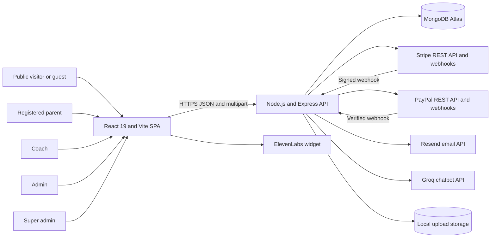

## 2. Repository/module structure

```mermaid
flowchart TB
    Root[cca-platform]

    Root --> App[app]
    Root --> Backend[backend]
    Root --> Docs[Operational and review documents]

    App --> PublicUI[Public pages and components]
    App --> RegUI[Registration and checkout]
    App --> ParentUI[Parent dashboard]
    App --> AdminUI[Admin portal]
    App --> CoachUI[Coach portal]
    App --> Contexts[Auth, cart, registration contexts]
    App --> ClientServices[Axios clients and services]
    App --> Utilities[PDF, month, weekly-batch utilities]

    Backend --> Server[server.js middleware and startup]
    Backend --> Routes[index.js, public_registration.js, chatbot.js]
    Backend --> Controllers[Auth, program, registration, coach, reports, webhooks]
    Backend --> Services[Stripe, PayPal, email, payment confirmation/failure]
    Backend --> Models[MongoDB and Mongoose models]
    Backend --> Middleware[Auth, RBAC, uploads, chatbot security]
    Backend --> Utils[Pricing, validation, tokens, logging, time]
    Backend --> Tests[node:test unit tests]
    Backend --> Scripts[Seed, migrations, historical pricing audit]
```

## 3. Frontend route topology

```mermaid
flowchart TB
    Browser[Browser URL]
    AppGate[App.tsx site-status gate]
    StatusAPI[GET /api/public/site-status]
    Maintenance[MaintenancePage]
    Router[AppRoutes]

    Browser --> AppGate
    AppGate --> StatusAPI
    AppGate -->|Enabled and route is not login or admin| Maintenance
    AppGate -->|Disabled or bypass route| Router

    Router --> PublicRoutes[Public routes]
    Router --> Login[/login]
    Router --> ParentGuard[Parent ProtectedRoute]
    Router --> AdminGuard[AdminProtectedRoute]
    Router --> CoachGuard[CoachProtectedRoute]

    PublicRoutes --> Home[/]
    PublicRoutes --> Programs[/programs and /programs/:id]
    PublicRoutes --> Content[/about /media /faq /donate]
    PublicRoutes --> Cart[/cart]
    PublicRoutes --> Checkout[/register-program /student-details /review-order /payment /success]

    ParentGuard --> ParentLayout[/dashboard]
    ParentLayout --> ParentHome[Dashboard home]
    ParentLayout --> Purchases[Purchases]
    ParentLayout --> Retry[Purchase payment retry]
    ParentLayout --> Students[Students]
    ParentLayout --> ParentMessages[Messages]
    ParentLayout --> Profile[Profile]

    AdminGuard --> AdminLayout[/admin]
    AdminLayout --> AdminDomains[Programs, registrations, content, reports, coaches, coupons]
    AdminLayout --> Recovery[Stripe and PayPal recovery]
    AdminLayout --> SiteSettings[Site maintenance settings]

    CoachGuard --> CoachLayout[/coach]
    CoachLayout --> CoachDomains[Dashboard, batches, students, scan, attendance, messages, profile]
```

## 4. Backend request pipeline

```mermaid
flowchart TB
    Request[Incoming request]
    Helmet[Helmet security headers]
    CORS[CORS allowlist]
    LoginLimit[Login-specific limiter]
    GeneralLimit[General API limiter]
    PaymentLimit[Payment or webhook limiter]
    StripeRaw{Stripe webhook?}
    StripeWebhook[Raw body Stripe webhook handler]
    Parsers[JSON, URL encoded, cookies]
    PayPalWebhook[PayPal webhook handler]
    Uploads[Static /uploads]
    ApiRouter[/api router]
    NotFound[JSON 404]
    ErrorHandler[Global error handler]

    Request --> Helmet --> CORS --> LoginLimit --> GeneralLimit --> PaymentLimit --> StripeRaw
    StripeRaw -->|Yes| StripeWebhook
    StripeRaw -->|No| Parsers
    Parsers --> PayPalWebhook
    Parsers --> Uploads
    Parsers --> ApiRouter
    ApiRouter --> NotFound
    StripeWebhook -. error .-> ErrorHandler
    ApiRouter -. error .-> ErrorHandler
```

## 5. API/domain map

```mermaid
flowchart LR
    API[/api]

    API --> Public[/public]
    API --> AdminAuth[/auth]
    API --> AdminDomain[Admin domain endpoints]
    API --> CoachAuth[/coach-auth]
    API --> CoachPortal[/coach-portal]

    Public --> Catalog[Programs, batches, categories, locations, content, coupons, coaches]
    Public --> ParentAuth[Parent auth]
    Public --> Payments[Stripe, PayPal, check registration, donations]
    Public --> ParentPortal[Parent dashboard, students, profile, messages]
    Public --> Chatbot[Chatbot]
    Public --> SiteStatus[Site status]

    AdminDomain --> MasterData[Programs, categories, locations, levels, age groups, batches]
    AdminDomain --> Registrations[Registrations, check actions, refunds, edit emails]
    AdminDomain --> Operations[Attendance, messages, reports, students, coaches]
    AdminDomain --> Content[Media, FAQs, sponsors, coupons]
    AdminDomain --> Settings[Site settings]
    AdminDomain --> AdminRecovery[Gateway recovery]

    CoachPortal --> CoachRoster[Batches and students]
    CoachPortal --> CoachAttendance[Scan and attendance]
    CoachPortal --> CoachMessages[Messages]
    CoachPortal --> CoachProfile[Profile and password]
```

## 6. Authentication and session lifecycle

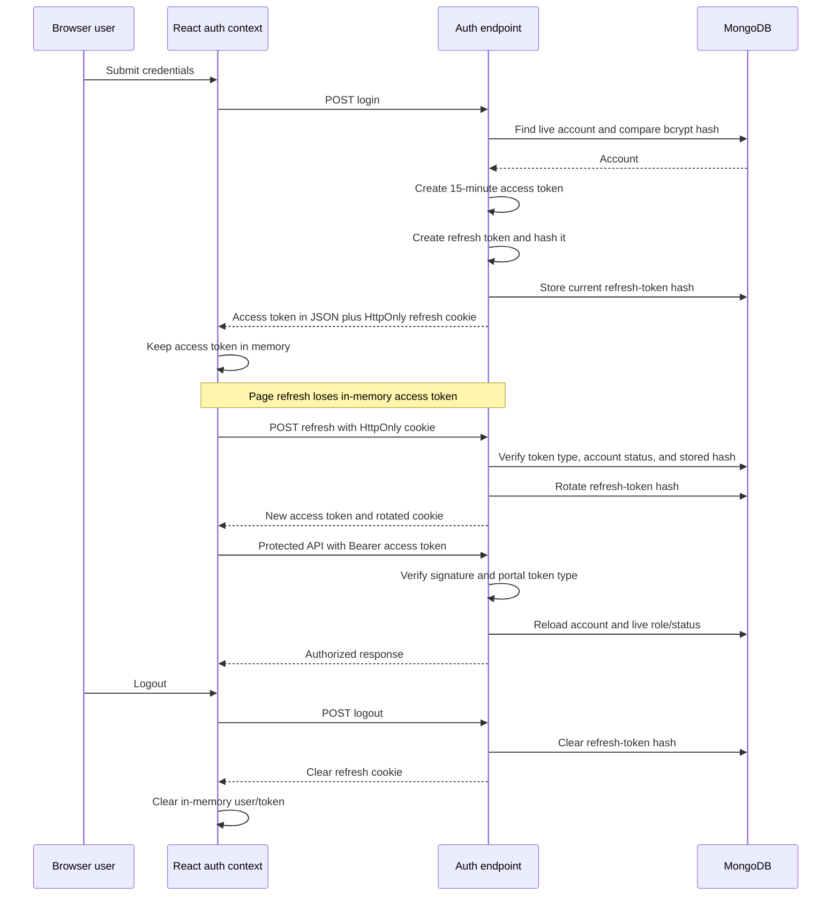

### Portal separation

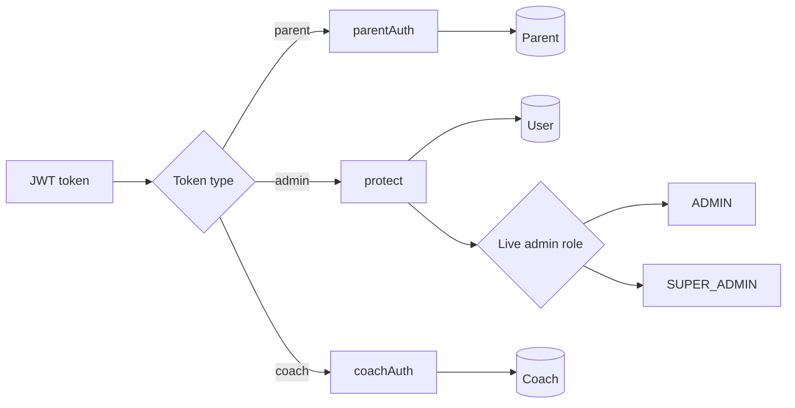

## 7. Core data model

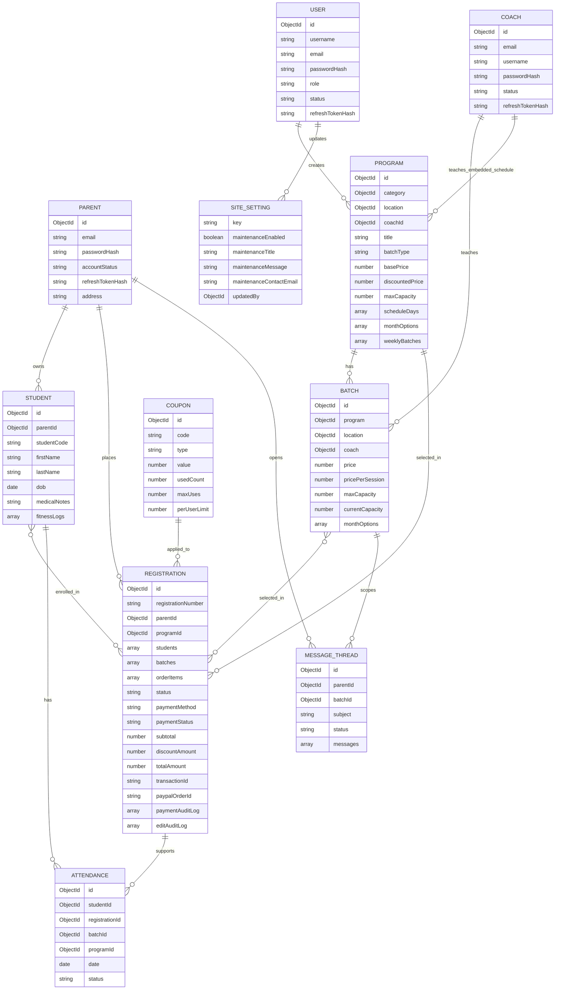

## 8. Public program and batch presentation

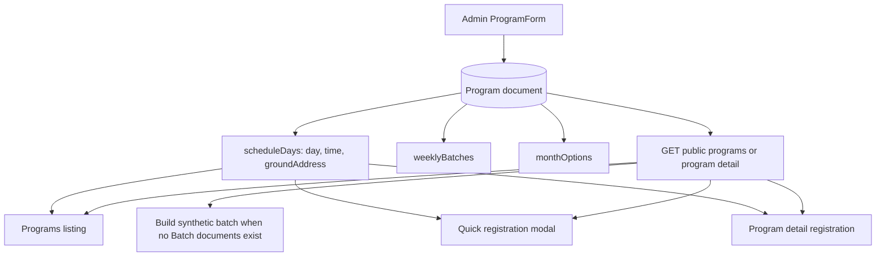

## 9. Registration UI state and cart flow

```mermaid
flowchart LR
    Browse[Program listing or details]
    Select[Select month, frequency, and day slots]
    Students[Enter/select students]
    CartContext[CartContext in localStorage]
    RegContext[RegistrationContext in memory and sessionStorage]
    Cart[/cart]
    Review[/review-order]
    Payment[/payment]
    Success[/success]

    Browse --> Select --> Students
    Students -->|Add to cart| CartContext
    Students -->|Single flow| RegContext
    CartContext --> Cart
    Cart --> Review
    RegContext --> Review
    Review -->|Edit| Select
    Review -->|Remove| CartContext
    Review --> Payment
    Payment --> Success

    CartContext -. stores child PII and medical notes .-> RiskPII[Known privacy risk]
    style RiskPII fill:#7f1d1d,color:#fff,stroke:#ef4444
```

## 10. Authoritative pricing logic — current implementation

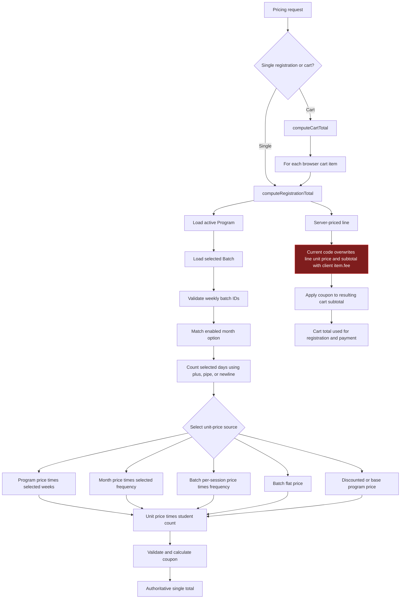

## 11. Registration creation — current transaction boundary

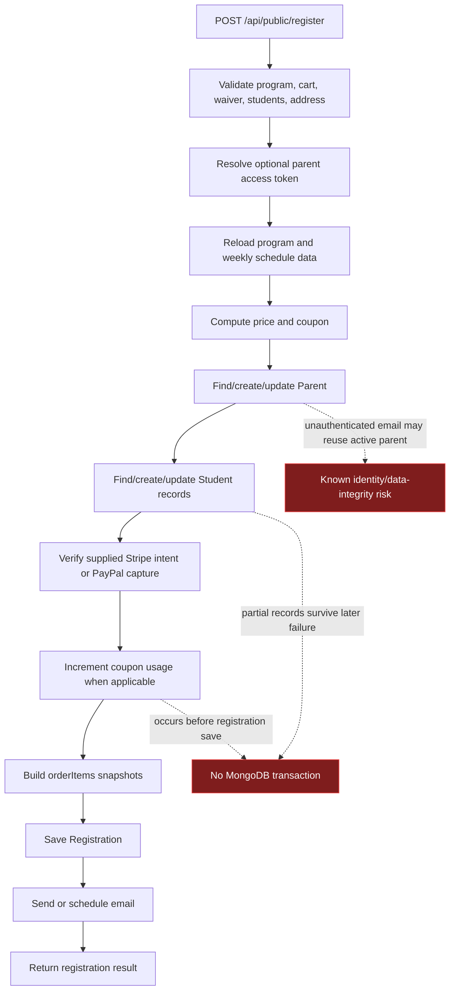

## 12. Registration and payment state model

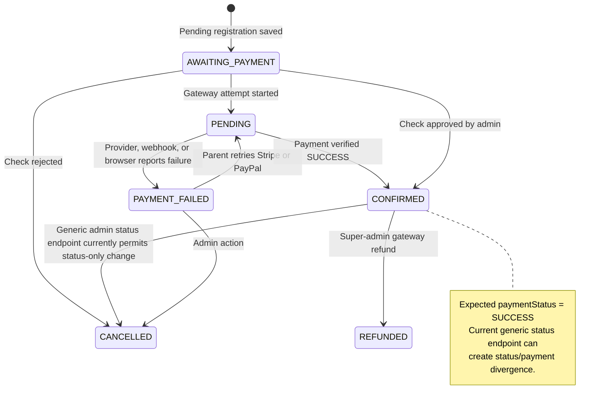

### Payment status axis

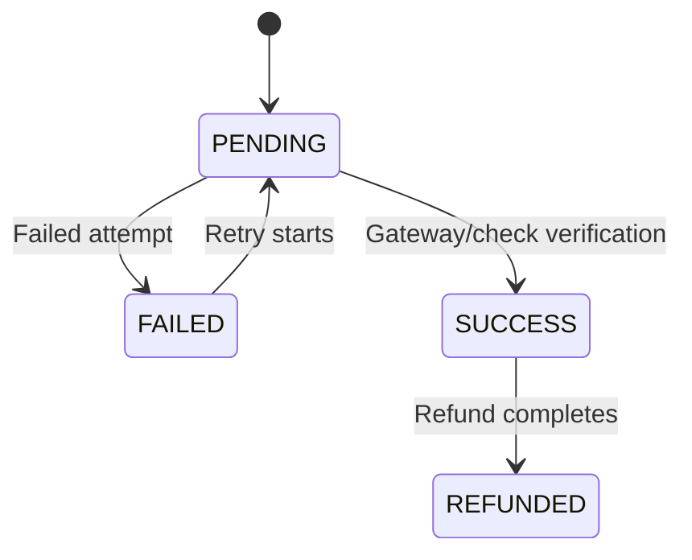

## 13. Stripe initial payment flow

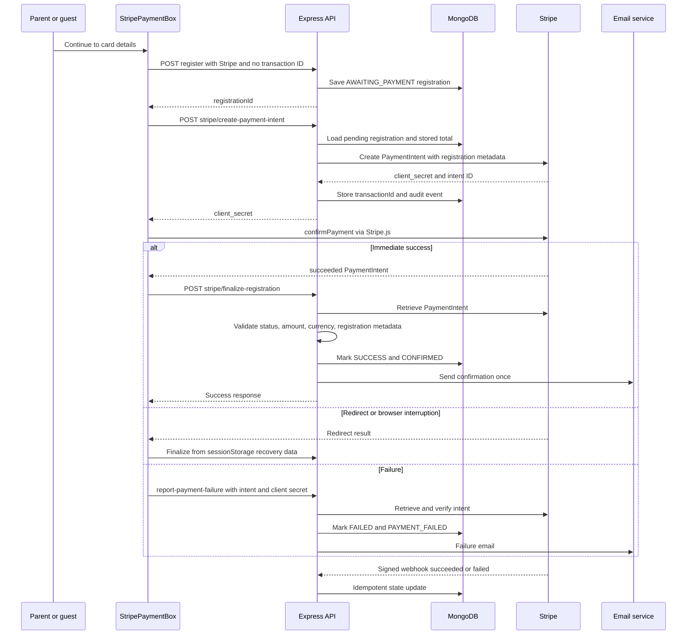

## 14. PayPal initial payment flow

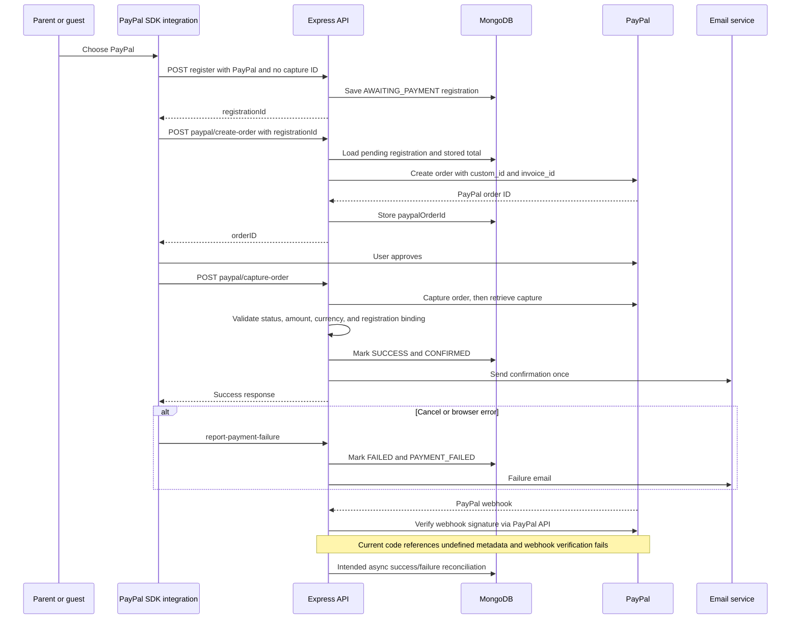

## 15. Check payment flow

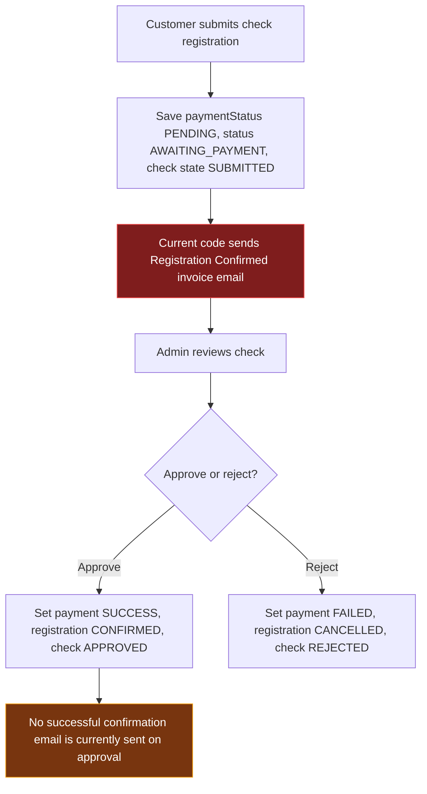

## 16. Parent payment retry flow

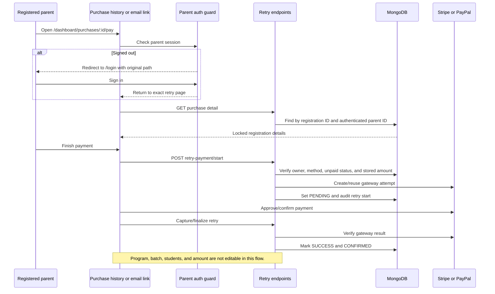

### Guest failure-email retry

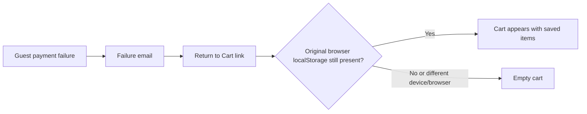

## 17. Payment success and failure notifications

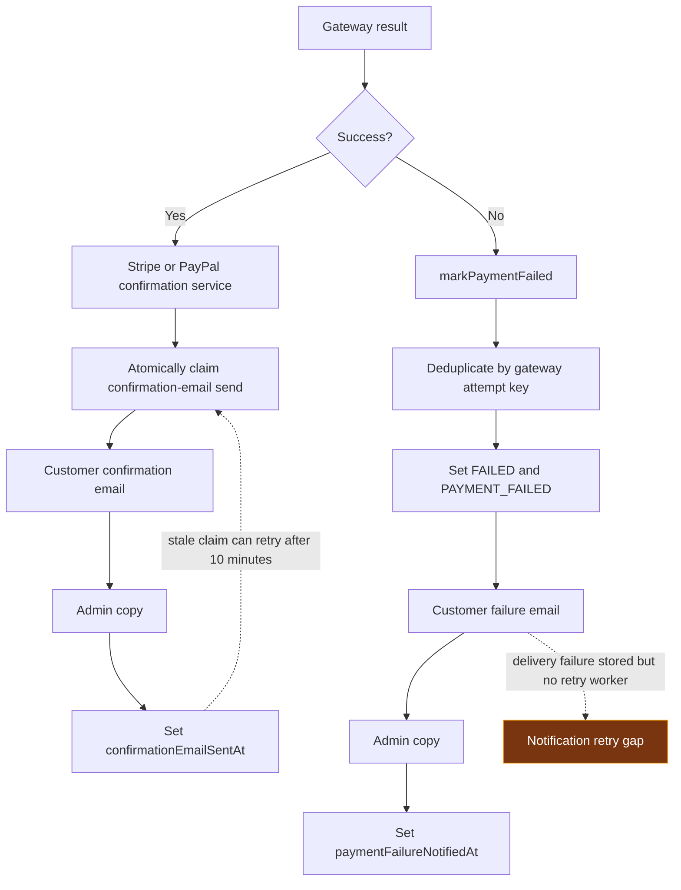

## 18. Coupon lifecycle — current behavior

```mermaid
flowchart TB
    Code[Coupon code]
    Load[Load active coupon]
    Rules[Check expiration, global limit, minimum, per-parent limit]
    Discount[Calculate percentage or fixed discount]
    PaymentType{Payment successful now or check submitted?}
    Increment[Atomic usedCount increment]
    IncrementResult{Increment succeeded?}
    SaveReg[Save registration]
    LaterSuccess[Stripe or PayPal later succeeds]
    ConfirmIncrement[Confirmation service claims and increments coupon]

    Code --> Load --> Rules --> Discount --> PaymentType
    PaymentType -->|PayPal or Stripe already successful, or check| Increment --> IncrementResult
    PaymentType -->|Pending online gateway| SaveReg --> LaterSuccess --> ConfirmIncrement
    IncrementResult -->|Yes| SaveReg
    IncrementResult -->|No| OmitCode[Omit couponCode but current discounted total remains]
    OmitCode --> SaveReg

    Increment -. happens before registration save .-> TxGap[No shared DB transaction]
    style OmitCode fill:#7f1d1d,color:#fff,stroke:#ef4444
    style TxGap fill:#7f1d1d,color:#fff,stroke:#ef4444
```

## 19. Admin registration editing and customer update email

```mermaid
sequenceDiagram
    participant S as Super admin
    participant API as Registration controller
    participant DB as MongoDB
    participant E as Email service
    participant P as Parent

    S->>API: PATCH registration edit
    API->>DB: Validate program, month, schedule, batch, and student fields
    API->>DB: Update snapshots and append ORDER_EDITED audit entry
    API-->>S: Saved; notificationPending true

    S->>API: POST send-update-email
    API->>DB: Load unsent ORDER_EDITED entries
    API->>E: Send aggregated change email
    E-->>P: Registration update details
    E-->>S: Admin copies through configured recipients
    API->>DB: Mark audit entries notified and append UPDATE_EMAIL_SENT
```

## 20. Refund flow

```mermaid
flowchart TB
    Request[Super admin refund request]
    Load[Load registration]
    Eligible{SUCCESS, not already refunded, gateway supported, transaction ID exists?}
    Gateway{Stripe or PayPal?}
    StripeRefund[Create Stripe refund]
    PayPalRefund[Refund PayPal capture]
    Persist[Set REFUNDED state, reference, amount, actor, audit log]
    Reject[Reject request]
    Race[Current code has no atomic REFUND_PROCESSING claim]

    Request --> Load --> Eligible
    Eligible -->|No| Reject
    Eligible -->|Yes| Gateway
    Gateway -->|Stripe| StripeRefund --> Persist
    Gateway -->|PayPal| PayPalRefund --> Persist
    Load -. concurrent requests can both pass eligibility .-> Race

    style Race fill:#78350f,color:#fff,stroke:#f59e0b
```

## 21. Parent, coach, and admin messaging

```mermaid
flowchart LR
    Parent[Authenticated parent]
    ParentCheck[Verify registration contains selected batch]
    Thread[(MessageThread scoped by parent and batch)]
    Admin[Authenticated admin]
    Coach[Authenticated coach]
    CoachCheck[Verify coach is assigned to thread batch]

    Parent --> ParentCheck --> Thread
    Admin --> Thread
    Coach --> CoachCheck --> Thread
    Thread --> Parent
    Thread --> Admin
    Thread --> Coach
```

## 22. Coach roster and attendance

```mermaid
flowchart TB
    Coach[Authenticated coach]
    Assignment{Real Batch or virtual Program schedule?}
    Real[Batch.coach equals coach ID]
    Virtual[Program.coachId equals coach ID]
    Registrations[Load registrations matching batch or program]
    StatusFilter[Current active statuses include PENDING and AWAITING_PAYMENT]
    Students[Authorized student roster]
    Scan[QR/manual attendance]
    Verify[Verify student belongs to coach batch/program]
    Attendance[(Attendance record by student, batch/program, date)]

    Coach --> Assignment
    Assignment --> Real --> Registrations
    Assignment --> Virtual --> Registrations
    Registrations --> StatusFilter --> Students --> Scan --> Verify --> Attendance

    style StatusFilter fill:#78350f,color:#fff,stroke:#f59e0b
```

## 23. Maintenance mode

```mermaid
sequenceDiagram
    participant S as Super admin
    participant AdminUI as /admin/site-settings
    participant API as Site settings API
    participant DB as SiteSetting
    participant Visitor as Public browser
    participant App as App.tsx

    S->>AdminUI: Edit title, message, contact, enabled flag
    AdminUI->>API: PUT /api/site-settings with admin bearer token
    API->>API: Require SUPER_ADMIN and validate fields
    API->>DB: Upsert public-site singleton
    API-->>AdminUI: Saved setting

    Visitor->>App: Load or navigate
    App->>API: GET /api/public/site-status with no-store
    API->>DB: Read public maintenance fields
    API-->>App: Current setting
    alt Enabled and route is not /login or /admin
        App-->>Visitor: MaintenancePage only
    else Disabled or bypass
        App-->>Visitor: Normal application routes
    else Status API fails
        App-->>Visitor: Current code fails open to normal application
    end
```

## 24. Reporting and invoice logic

```mermaid
flowchart TB
    Registration[(Registration)]
    ParentHistory[Parent purchase history]
    PaidCheck{paymentStatus equals SUCCESS?}
    Invoice[Download invoice PDF]

    Registration --> ParentHistory --> PaidCheck
    PaidCheck -->|Yes| Invoice
    PaidCheck -->|No| Hidden[Invoice action hidden]

    Registration --> AdminReports[Admin dashboard and revenue reports]
    AdminReports --> StatusRule[Current revenue filter uses status CONFIRMED or PAID]
    StatusRule --> Revenue[Revenue totals and charts]
    StatusRule -. may include unpaid status-only confirmations .-> ReportRisk[Known reporting risk]

    style ReportRisk fill:#78350f,color:#fff,stroke:#f59e0b
```

## 25. Upload/media flow

```mermaid
flowchart LR
    Admin[Admin or coach upload form]
    Multer[Multer disk storage]
    Filter[Extension and size filters]
    Folder[Local uploads subfolder]
    URL[Absolute public /uploads URL stored in MongoDB]
    Static[Express static serving]
    Browser[Public browser]

    Admin --> Multer --> Filter --> Folder --> URL
    URL --> Static --> Browser
    Filter -. no magic-byte/content scan .-> UploadRisk[Content validation gap]
    Folder -. local disk may be ephemeral .-> StorageRisk[Durability gap]

    style UploadRisk fill:#78350f,color:#fff,stroke:#f59e0b
    style StorageRisk fill:#78350f,color:#fff,stroke:#f59e0b
```

## 26. Chatbot flow

```mermaid
flowchart TB
    User[Guest or optional authenticated parent]
    Limits[Chatbot rate limits]
    Validation[Shape and size validation]
    Injection[Prompt-injection guard]
    Context[Load active programs, FAQs, locations]
    Prompt[Build grounded system prompt]
    Groq[Groq completion]
    Sanitize[Redact secrets, strip markup, rewrite false confirmations]
    Reply[Return assistant reply]

    User --> Limits --> Validation --> Injection --> Context --> Prompt --> Groq --> Sanitize --> Reply

    User --> Recommend[Deterministic program recommendation]
    User --> BMI[BMI calculation]
    BMI --> OwnStudent{Authenticated and owns student?}
    OwnStudent -->|Yes| Fitness[(Student fitnessLogs)]
```

## 27. Deployment/runtime view

```mermaid
flowchart TB
    Build[Frontend TypeScript and Vite build]
    StaticHost[SPA static hosting with redirect fallback]
    NodeHost[Node/Express host]
    Env[Environment variables]
    Mongo[(MongoDB)]
    Providers[Stripe, PayPal, Resend, Groq]
    UploadDisk[(Host filesystem uploads)]

    Build --> StaticHost
    StaticHost -->|VITE_API_BASE_URL| NodeHost
    Env --> StaticHost
    Env --> NodeHost
    NodeHost --> Mongo
    NodeHost --> Providers
    NodeHost --> UploadDisk

    Env --> Secrets[JWT, Mongo, gateway, email, AI secrets]
    Env --> PublicKeys[Stripe publishable key and PayPal client ID]
```

## 28. Current observability and audit trail

```mermaid
flowchart LR
    API[Backend actions]
    Console[Console logs]
    PaymentLog[Structured payment/security log helpers]
    RegAudit[(Registration paymentAuditLog)]
    EditAudit[(Registration editAuditLog)]
    EmailState[Email sent/error timestamps]
    WebhookEvents[(PaymentWebhookEvent dedup collection)]

    API --> Console
    API --> PaymentLog
    API --> RegAudit
    API --> EditAudit
    API --> EmailState
    API --> WebhookEvents

    Console -. no centralized log/metric/alert system found .-> OpsGap[Operational visibility gap]
    EmailState -. failure emails have no retry worker .-> OpsGap

    style OpsGap fill:#78350f,color:#fff,stroke:#f59e0b
```

## 29. Recommended target architecture for the payment core

This final diagram is intentionally labeled **target**, unlike the preceding current-state diagrams.

```mermaid
flowchart TB
    Commands[Checkout, retry, refund commands]
    OrderService[Registration and Order State Machine]
    Pricing[Authoritative Pricing Service]
    Capacity[Capacity Reservation Service]
    DBTx[MongoDB transaction]
    PaymentAttempt[(PaymentAttempt collection)]
    Gateway[Idempotent Stripe or PayPal adapter]
    Webhooks[Verified webhook inbox]
    Reconciler[Payment reconciliation worker]
    Outbox[(Notification outbox)]
    Worker[Email worker with retry/backoff]
    Audit[(Immutable audit events)]

    Commands --> OrderService
    OrderService --> Pricing
    OrderService --> Capacity
    OrderService --> DBTx
    DBTx --> PaymentAttempt
    DBTx --> Outbox
    DBTx --> Audit
    PaymentAttempt --> Gateway
    Gateway --> Webhooks
    Webhooks --> Reconciler
    Reconciler --> OrderService
    Outbox --> Worker
```

## 30. Diagram-to-code index

| Area | Primary files |
|---|---|
| App gate and maintenance | `app/src/App.tsx`, `app/src/pages/MaintenancePage.tsx`, `app/src/admin/pages/SiteSettings.jsx` |
| Frontend routes | `app/src/routes/AppRoutes.tsx` |
| Parent/admin/coach auth | `app/src/context/AuthContext.tsx`, `app/src/admin/context/AuthContext.jsx`, `app/src/coach/context/AuthContext.jsx` |
| Cart and registration state | `app/src/context/CartContext.tsx`, `app/src/context/RegistrationContext.tsx` |
| Checkout | `app/src/pages/registration/*`, `app/src/pages/cart/CartPage.tsx` |
| Stripe UI | `app/src/components/payments/StripePaymentBox.tsx` |
| Parent payment retry | `app/src/pages/dashboard/RetryPayment.tsx`, `app/src/services/parentDashboardService.ts` |
| Server middleware | `backend/src/server.js` |
| Main API routes | `backend/src/routes/index.js`, `backend/src/routes/public_registration.js` |
| Pricing | `backend/src/utils/pricing.js` |
| Gateway integrations | `backend/src/services/stripeService.js`, `backend/src/services/paypalService.js` |
| Gateway confirmation | `backend/src/services/stripeRegistrationService.js`, `backend/src/services/paypalRegistrationService.js` |
| Payment failures | `backend/src/services/paymentFailureService.js`, webhook controllers |
| Email | `backend/src/services/emailService.js` |
| Registration administration | `backend/src/controllers/registrationController.js` |
| Models | `backend/src/models/*` |
| Coach portal | `backend/src/controllers/coachPortalController.js` |
| Chatbot | `backend/src/routes/chatbot.js`, `backend/src/middleware/chatbotSecurity.js` |
| Audit/migrations | `backend/src/config/*` |

